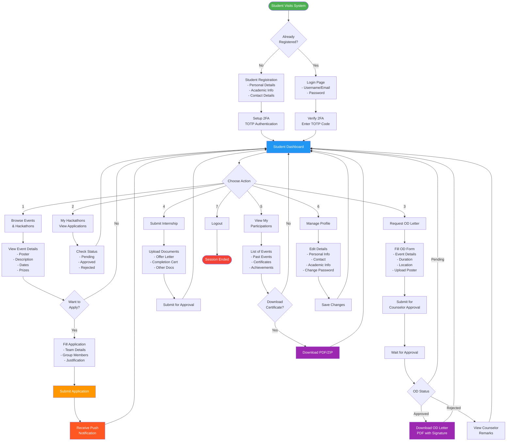

# Student User Flow - Event Management System

## Overview
This document describes the complete user journey for students using the Event Management System at Sona College of Technology.

## User Flow Diagram



## Detailed User Journey

### 1. Registration & Authentication
- **First Time Users**: Complete registration with personal and academic details
- **2FA Setup**: Configure Time-based One-Time Password (TOTP) authentication
- **Login**: Authenticate with credentials and 2FA code
- **Session Management**: Secure session with timeout protection

### 2. Browse & Apply for Events
- **Event Discovery**: Browse available hackathons and events
- **View Details**: See event posters, descriptions, dates, prizes, and requirements
- **Application**: Submit applications with team details and group members
- **Notifications**: Receive push notifications on application status

### 3. OD Letter Management
- **Request OD**: Fill form with event details, duration, and location
- **Poster Upload**: Attach event poster (JPG, PNG, PDF - max 5MB)
- **Approval Workflow**: Submit to class counselor for approval
- **Download**: Get PDF letter with digital signature when approved
- **Verification**: Each letter includes verification code for authenticity

### 4. Internship Submissions
- **Document Upload**: Submit offer letters, completion certificates
- **Approval Tracking**: Monitor approval status from counselor
- **Document Management**: Organize all internship-related documents

### 5. Participation Tracking
- **History**: View all past and current event participations
- **Certificates**: Download participation certificates
- **Achievements**: Track prizes, rankings, and achievements
- **Bulk Download**: Download multiple certificates as ZIP

### 6. Profile Management
- **Personal Information**: Update contact details and academic info
- **Security**: Change password and manage 2FA settings
- **Preferences**: Configure notification preferences

## Key Features

### Security
- Two-Factor Authentication (2FA)
- Session timeout management
- CSRF protection on all forms
- Secure password recovery via DOB verification

### User Experience
- Progressive Web App (PWA) - installable on mobile
- Push notifications for important updates
- Responsive design for all devices
- Material Design interface

### Document Management
- Professional PDF generation
- Digital signature verification
- QR code generation for verification
- Bulk download capabilities

## Technical Flow

### Authentication Flow
1. User enters credentials
2. System validates against database
3. 2FA verification required
4. Session token generated (single device)
5. Dashboard access granted

### Application Flow
1. Browse available events
2. Click "Apply" on desired event
3. Fill application form (validation)
4. Submit with CSRF token
5. Database record created
6. Push notification sent
7. Confirmation displayed

### OD Request Flow
1. Access OD request form
2. Fill event details
3. Upload poster (optional but recommended)
4. Submit to counselor
5. Counselor reviews and approves/rejects
6. Student receives notification
7. If approved, download PDF with signature
8. PDF includes verification code for authenticity

## User Roles Integration

### Student ↔ Counselor
- Students assigned to class counselors
- Counselors approve OD requests
- Counselors verify event participations
- Counselors can send reminders to students

### Student ↔ Admin
- Admins create and manage events
- Admins can view all student applications
- Admins generate reports and exports
- Admins manage user accounts

## Navigation Map

```
Student Portal
├── Dashboard (Home)
├── Events & Hackathons
│   ├── Browse All Events
│   ├── Event Details
│   ├── Apply for Event
│   └── My Applications
├── OD Requests
│   ├── New OD Request
│   ├── View My Requests
│   └── Download Approved Letters
├── Internships
│   ├── Submit Internship
│   └── View Submissions
├── My Participations
│   ├── Past Events
│   ├── Certificates
│   └── Download Certificates
└── Profile
    ├── Personal Information
    ├── Change Password
    └── 2FA Settings
```

## Best Practices for Students

1. **Keep 2FA Secure**: Save backup codes in a secure location
2. **Complete Profile**: Fill all profile details for better communication
3. **Upload Quality Posters**: High-quality event posters improve OD approval rates
4. **Apply Early**: Submit applications well before deadlines
5. **Check Regularly**: Monitor application and OD request status
6. **Download Documents**: Save approved OD letters and certificates immediately
7. **Update Information**: Keep contact details current for notifications

## Support & Help

- **Forgot Password**: Use DOB-based recovery system
- **2FA Issues**: Contact system administrator
- **OD Approval**: Contact your class counselor
- **Technical Issues**: Refer to system help section or IT support

---

*Student User Flow Documentation v1.0*
*Event Management System - Sona College of Technology*
